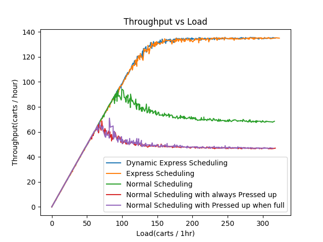

# Elevator

An elevator simulator for simulating moving carts during dormitory move-out, 
and computes the throughput under various load conditions for different algorithms.

Created for UCLA USAC general representative 2 2019-2020 projects. 

## Load assumptions:

This simulator is designed for transporting moving carts during dormitory move-out. 
Therefore, the elevator can hold only 2 moving carts, 
and all the carts are going from second and above floors, trying to go down to the first floor. 

Furthermore, The passengers may start pressing the up button in an attempt to get to the ground sooner. 
This may cause further thrashing on the scheduling algorithm.
In this simulator, we allow for 3 behaviors:
- No pressing
- Always pressing
- Pressing when the queue is long (above 5 carts in the queue of the floor)

The timing constraints of the elevator based on UCLA Sproul hall. 

## Scheduling algorithms:

`MinMaxScheduler`: attempts to simulate the normal scheduling schema of the elevator. 

`ExpressScheduler`: attempts to simulate an elevator operator directly operates the elevtor.
from the ground floor, it goes to each floor one-by-one, and return to the ground directly from that floor. 

It constantly runs like 1-2-1-3-1-4-1-....-1-n-1-2-1...

`DynamicExpressScheduler`: attempts to simulate a more intelligent scenario of elevator operator. 
 In addition to `ExpressScheduler`'s scheduling, it will continue to next dormitory floor if the elevator cab is not full. 

## Experiment:

We tested the following 5 scenarios:

| Scenario | Scheduler | Press up button|
|---|---|---|
|1|MinMaxScheduler|None|
|2|MinMaxScheduler|Always|
|3|MinMaxScheduler|When queue is long|
|4|ExpressScheduler|None|
|5|DynamicExpressScheduler|None|

We did not test ExpressScheduler and DynamicExpressScheduler when up button pressed
because the algorithm does not check the call button at all. 

The simulations run with load from 0 to ~320 carts per hour in total for a 7-story dormitory building.
For each of the load between 0 to 320 seconds, the simulation is run for 4 in-simulation hours, and repeated for 4 times.

The metrics are as follow:
- Throughput: number of carts arrives at the ground floor per hour, computed at the end of 4-hour simulation.
- Longest Queue: the longest queue at the end of the 4-hour simulation. 
- Turnaround time: the average time it takes for a cart to enter the queue to arrive at the ground. For the cart that did not arrive at the ground at the 4-hour simulator,
time, the elevator keeps running until all of them arrive at the ground. 
## Results:

Simulation demonstration: 

Metrics plot: 

For Normal scheduling, the thrashing starts around 60-100 carts/hr
depends on the pressing up behavior, and the throughput drops
for Normal scheduling after this point if more carts are waiting. 
On the other hand, Express Scheduler does not have a thrashing behavior, 
and therefore achieve a much higher throughput when busy. 

When the Normal scheduler is lightly loaded, it has a better turnaround time
then the Express scheduler; However, when highly loaded, 
the express scheduler gives better performance on all three 
metrics. 

Therefore, we recommend the use of express scheduling 
at the dormitory move-out, when the elevator is heavily loaded
with moving carts. 

# Running the simulation

## Requirements:
Python 3.7, configured with Tkinter. 
To run the Plotter, `matplotlib` is also required.

## Running:
To run the Simulation in GUI, run:

`python Simulator.py`

To run the Elevator and generate plots on throughput, run:

`python Plotter.py`

